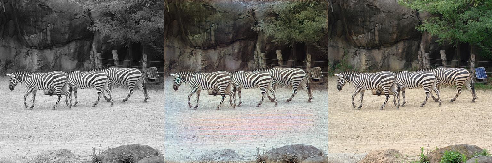
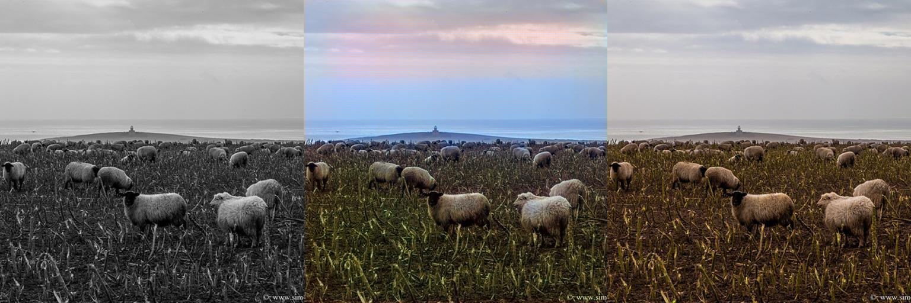
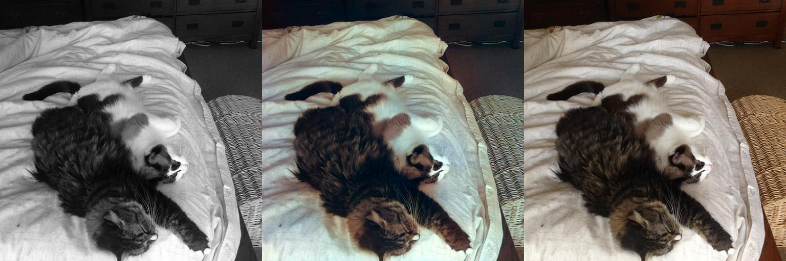
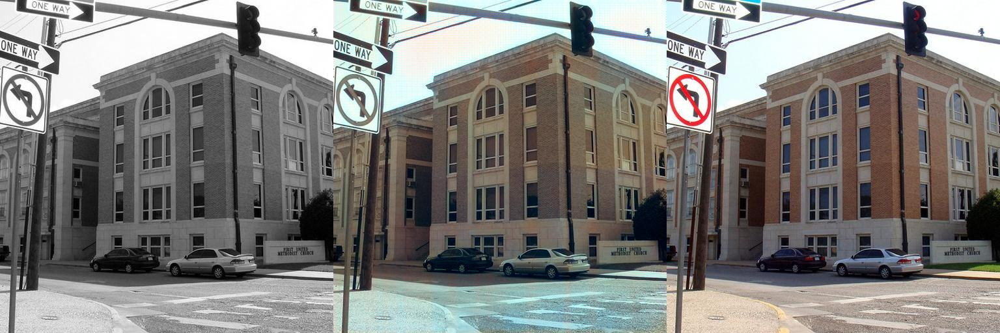
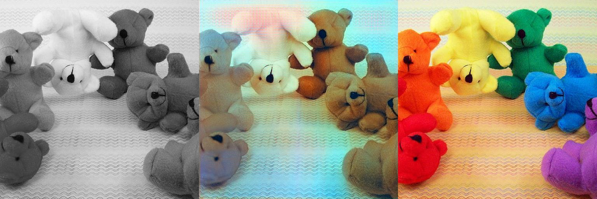
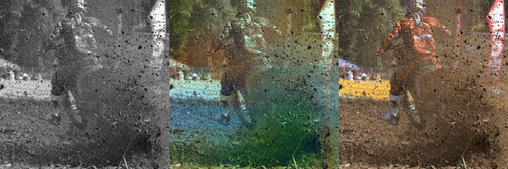
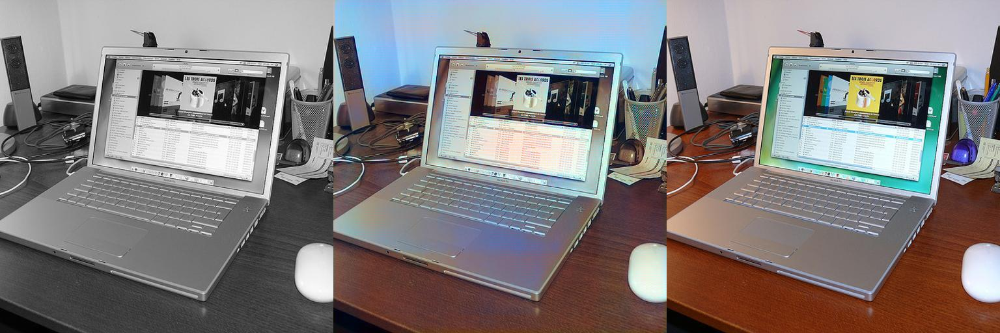

# Colorize-Photos-V2 - Machine Learning for Colorizing Black and White Photos

Hello folks! Today, I'm going to tell you about my project "Colorize-Photos-V2". The reason it's V2 is that there's also a V1. If you see the results and think, "What is this, it's terrible," don't even look at V1, it's even worse, just saying :D Let's dive into the project from start to finish, shall we?

Let me explain my project in detail. We used the COCO Train 2017 dataset, maybe that's why, or maybe because of my system's limitations, we could only use the model with the result of the 3rd epoch. My poor laptop and I did our best, I tried hard to optimize it. If you want to try this project, you can put a large number of photos (I used 118k photos) into the `train_2017` folder and train your own model step by step. It's quite a fun job, I recommend trying it.

Regarding model training: If your GPU supports CUDA, you can complete the processes quite quickly, compared to the CPU, you'll fly. Whether your GPU is a 5090, a 3070Ti, or any CUDA-supported one, the system starts with the lowest usage and adjusts CPU workers, I/O operations, or image batch processes based on your system's usage, inspired by the `V-tec` technology in my old Honda Civic. So even if your system is crappy, it gets optimized somehow and works like a charm. If it doesn't use CUDA, it switches to the CPU, but then it might take 3-5 years, so I think a CUDA-supported GPU is a must. :D

Let me talk a bit about the technologies and dataset I used. In this project, I used PyTorch as the main framework, and I worked with OpenCV and skimage libraries for image processing. I preferred the COCO Train 2017 dataset, but you can try it with different photos. The codes are open source on GitHub, take them, tinker with them, train your own model. As for my system specs, I'm using an `MSI GL76` with an `i7-12700H and RTX 3070Ti 8 GB`. It doesn't look too bad, but it took me 8 hours to reach the 3rd epoch, imagine that... At 2 AM, I said, "Let this batch finish, and I'll go to bed," and at 6 AM, I found myself dozing off in front of the monitor, I was about to cry from sleep deprivation. :') I had to stop at the 3rd epoch because the system couldn't handle it anymore, and the dataset was quite large. But even in this state, it wasn't too bad, it produces results that are a notch above average in colorizing black and white photos.

You can also train this model with different photo sets and/or more powerful devices, in short, `Have Fun`. I wanted to do a study on image processing and machine learning, which is a personal curiosity of mine, rather than developing it professionally. I think it didn't turn out too bad, what do you think?
### Maybe in the future, I'll prepare a nice GUI with `QtPy` for a better user experience and easier use. But right now, I have other freelance jobs and projects to work on, so this idea is on hold for a bit. Still, stay tuned folks, because my next project will be a machine learning study about `CS:GO`, now known as `CS:2`, which I used to play with love. I'll apply a few of my deep learning ideas, it will be quite a fun project, I recommend staying tuned :D

## Sample Outputs

To see how the project works, I put 7 sample outputs from the 3rd epoch in the main directory. It didn't do a bad job in colorizing black and white photos, what do you think? You can see them below:
On the left is the Monochrome photo, in the middle is the model output, and on the right is the original color photo.

- 
- 
- 
- 
- 
- 
- 

## Setup

Before running this project, I highly recommend following these steps :D

1. **Install Required Libraries:**

    Paste the following command into the terminal and run it, all dependencies will be installed:

    ```bash
    pip install torch torchvision torchaudio numpy opencv-python scikit-image pillow psutil keyboard
    ```

    If you have a CUDA-supported GPU, make sure to install the CUDA version of PyTorch, otherwise, it will switch to the CPU and training might take 3-5 years, just saying! :D Alternatively, you can use the `requirements.txt` file in the project and install it with this command:

    ```bash
    pip install -r requirements.txt
    ```

2. **Clone the Project:**

    To clone:

    ```bash
    git clone https://github.com/username/colorize-photos-v2.git
    cd colorize-photos-v2
    ```

3. **Prepare Necessary Files:**

    - Put your black and white photos in the `train_2017` folder (for training).
    - Add the user photos you want to colorize to the `input_user` folder.

## Usage

Follow these steps to run different stages of the project:

1. **Train the Model:**

    To start training:

    ```bash
    python 3-train.py
    ```

    This will train the model with the photos in the `train_2017` folder and save it to the `models/generator.pth` file. It stops after 3 epochs, it took 8 hours on my system! :D

2. **Colorize User Photos:**

    To colorize photos from the user:

    ```bash
    python 5-user_inputs.py --input_dir input_user --output_dir output_user
    ```

    This will take the photos from the `input_user` folder, colorize them, and save them as `_predicted.png` and `_collage.png` files in the `output_user` folder. The collage shows the original black and white and colorized versions side by side.

3. **Other Steps:**

    - `1-preprocess.py`: Used to preprocess data (optional).
    - `2-move_val.py`: To separate the validation set.
    - `3-train.py`: To train the model and get your generate.pth file.
    - `4-run-model.py`: To test the model (usually for post-training testing).
    - `5-user_inputs.py`: To test and colorize photos provided by the user.

## Theoretical Structure of the Code

This project uses a deep learning model based on the U-Net architecture to colorize black and white photos. Here's the basic logic:

- **Data Processing:** Photos are converted from RGB to LAB color space. The L channel (brightness) is the input to the model, and the AB channels (color information) are predicted as output.
- **Model Architecture:** U-Net works with an encoder-decoder structure. The encoder reduces the image to feature maps, while the decoder converts these maps back to AB channels for recoloring. Skip connections reduce detail loss.
- **Training:** Trained with the COCO Train 2017 dataset for 3 epochs. The model predicts AB channels in LAB space, correcting sepia-like color errors with techniques like Tanh activation and histogram equalization.
- **Output:** The predicted AB channels are combined with the L channel, converted back to RGB, and the color saturation is increased to get the result.

This is a basic example of image colorization with machine learning. You can improve the results with more epochs and a powerful system!

## Technologies and Dataset Used

- **Framework:** PyTorch (used as the main framework, essential for model training).
- **Image Processing:** OpenCV and scikit-image (for color conversions and processing).
- **Other Libraries:** PIL (for managing image files), numpy (for numerical operations), psutil (for monitoring system resources), keyboard (for stopping the training with a key).
- **Dataset:** COCO Train 2017 (a quite large dataset, but you can try with different photos).

### I admit it turned out a bit like a diary. But I wanted to vent a little and talk about my future plans. I didn't see it fit to write in a monotonous `mono tone` like a robot for this project related to colors :) Have a good day everyone..


#
#
#
#
#
#

# Colorize-Photos-V2 - Siyah-Beyaz Fotoğrafları Renklendiren Makine Öğrenmesi


Selamlar agalar! Bugün sizlere "Colorize-Photos-V2" projemi anlatacağım. Tabii V2 olmasının sebebi, bunun bir de V1’i oluşu. Eğer sonuçları görüp "Bu ne ya, hiç olmadı" derseniz, V1’i sakın görmeyin, o daha boktan, benden söylemesi :D Hadi gelin, projeyi baştan sona masaya yatıralım, her detayıyla anlatayım, ne dersiniz?

Şimdi her şeyiyle her detayıyla anlatayım projemi. Dataset olarak COCO Train 2017’yi kullandık, belki ondandır, belki de benim sistemimin yetersizliği yüzünden, sadece 3. epoch sonucuyla modelimizi kullanabildik. Ben ve gariban laptopum elimizden gelenin fazlasını yaptık, optimize etmek için uğraştım didindim. Eğer siz de bu projeyi denemek isterseniz, `train_2017` klasörünün içine büyük çapta (ben 118k fotoğraf kullandım) fotoğraflarınızı koyarak pekala adım adım kendi modelinizi eğitip bu projeyi kullanabilirsiniz. Bayağı keyifli bir iş, deneyin derim.

Model eğitimi konusunda şöyle bir şey var: Eğer GPU’nuz CUDA destekliyse, işlemleri oldukça hızlı tamamlayabilirsiniz, CPU’ya kıyasla resmen uçarsınız. GPU’nuz 5090 da olsa, 3070Ti da olsa, ya da CUDA destekli her ne olursa olsun, sistem kullanımları en düşükte başlayıp sisteminizin kullanımına göre CPU workers’larını, I/O işlemlerini veya image batch işlemlerini, tıpkı eski arabam Honda Civic’deki `V-tec` teknolojisinden ilham alarak, kademeli olarak kod çalışırken duruma göre artırıp azaltıyor. Yani sisteminiz dandik bile olsa bir şekilde optimize oluyor, mis gibi çalışıyor. Tabii CUDA kullanmıyorsa CPU’ya geçiyor, ama o zaman işiniz bayağı uzar, belki bir 3-5 yıl sürer, o yüzden bence CUDA destekli bir GPU şart. :D

Kullandığım teknolojiler ve dataset’ten bahsedeyim biraz. Bu projede PyTorch’u ana framework olarak kullandım, görüntü işleme için de OpenCV ve skimage kütüphaneleriyle uğraştım. Dataset olarak COCO Train 2017’yi tercih ettim, ama siz farklı fotoğraflarla da deneyebilirsiniz. Kodlar zaten GitHub’da açık kaynak, alın, kurcalayın, kendi modelinizi eğitin.. Sistem özelliklerime gelince, `MSI GL76` kullanıyorum, içinde `i7-12700H ve RTX 3070Ti 8 GB` var. Fena değil gibi görünüyor ama 3. epoch’a gelmem 8 saat sürdü, düşünün artık.... Gece 2’de "Şu batch bitsin de yatayım" dedim, sabah 6’da monitörün başında uyuklarken buldum kendimi, uykusuzluktan ağlayacaktım. :') 3. epoch’ta durmak zorunda kaldım, çünkü sistem daha fazla kaldırmadı, dataset de bayağı büyük. Ama bu haliyle bile fena olmadı, siyah-beyaz fotoğrafları renklendirmede vasatın iki tık üstü işler çıkarıyor.

Sizler de bu modeli farklı foto setleriyle ve/veya daha güçlü cihazlarla eğitebilir, kısacası `Eğlenebilirsiniz` Ben profesyonelce geliştirmekten daha çok, kişisel bir merakım olan görüntü işleme ve makina öğrenmesi hakkında bir çalışma yaparak bu konuda bir deneme yapmak istedim. Bence fena da olmadı, ne dersiniz? 
### İlerleyen zamanlarda belki `QtPy` ile güzel bir GUI de hazırlarım ki daha güzel bir kullanıcı deneyimiyle kolayca kullanılsın. Ama şu anda üzerinde uğraşmam gereken diğer freelance işler ve projelerim var, o yüzden bu fikir biraz rafa kalktı. Yine de takipte kalın agalar, çünkü bir sonraki projem eskiden severek oynadığım `CS:GO` nam-ı bu sıralar `CS:2` hakkında bir makina öğrenmesi çalışması olacak. Derin öğrenme ile ilgili birkaç fikrimi uygulayacağım, bayağı eğlenceli bir proje olacak, takipte kalmanızı öneririm :D


## Örnek Çıktılar

Projenin nasıl çalıştığını görmek için ana dizine 3. epoch’tan çıkan 7 tane örnek çıktı koydum. Siyah-beyaz fotoğrafları renklendirme konusunda fena iş çıkarmadı, siz ne dersiniz? Aşağıda görebilirsiniz:
En solda MonoChrome fotoğraf, Ortada model çıktısı ve en sağda ise fotoğrafın orijinal renkleri bulunmakta.

- 
- 
- 
- 
- 
- 
- 

## Kurulum

Bu projeyi çalıştırmadan önce aşağıdaki adımları izlemenizi oldukça öneririm :D

1. **Gerekli Kütüphaneleri Kurun:**

   Aşağıdaki komutu terminale yapıştırıp çalıştırın, tüm bağımlılıklar yüklenecek:

   ```bash
   pip install torch torchvision torchaudio numpy opencv-python scikit-image pillow psutil keyboard
   ```

   Eğer CUDA destekli bir GPU’nuz varsa, PyTorch’un CUDA versiyonunu yüklediğinizden emin olun, yoksa CPU’ya geçer ve eğitim 3-5 yıl sürebilir, benden söylemesi! :D Alternatif olarak, projedeki `requirements.txt` dosyasını kullanarak şu komutla da kurabilirsiniz:

   ```bash
   pip install -r requirements.txt
   ```

2. **Projeyi Klonlayın:**

   Klonlamak için:

   ```bash
   git clone https://github.com/kullaniciadi/colorize-photos-v2.git
   cd colorize-photos-v2
   ```

3. **Gerekli Dosyaları Hazırlayın:**

   - `train_2017` klasörüne siyah-beyaz fotoğraflarınızı koyun (eğitim için).
   - `input_user` klasörüne renklendirmek istediğiniz kullanıcı fotoğraflarınızı ekleyin.

## Kullanım

Projenin farklı aşamalarını çalıştırmak için aşağıdaki adımları izleyin:

1. **Modeli Eğitin:**

   Eğitimi başlatmak için:

   ```bash
   python 3-train.py
   ```

   Bu, `train_2017` klasöründeki fotoğraflarla modeli eğitir ve `models/generator.pth` dosyasına kaydeder. 3 epoch sonra durur, benim sistemimde 8 saat sürdü! :D

2. **Kullanıcı Fotoğraflarını Renklendirin:**

   Kullanıcıdan gelen fotoğrafları renklendirmek için:

   ```bash
   python 5-user_inputs.py --input_dir input_user --output_dir output_user
   ```

   Bu, `input_user` klasöründeki fotoğrafları alır, renklendirir ve `output_user` klasörüne `_predicted.png` ve `_collage.png` dosyaları olarak kaydeder. Kolaj, orijinal siyah-beyaz ve renklendirilmiş hali yan yana gösterir.

3. **Diğer Adımlar:**

   - `1-preprocess.py`: Verileri ön işlemek için kullanılır (isteğe bağlı).
   - `2-move_val.py`: Validation setini ayırmak için.
   - `3-train.py`: Modeli eğitip generate.pth dosyanızı elde edebilmeniz için.
   - `4-run-model.py`: Modeli test etmek için (genelde eğitim sonrası test için).
   - `5-user_inputs.py`: Kullanıcı tarafından girilen fotoğrafları test etmek ve rneklendirmek için.
## Kodun Teorik Yapısı

Bu proje, siyah-beyaz fotoğrafları renklendirmek için U-Net mimarisine dayalı bir derin öğrenme modeli kullanıyor. İşte temel mantık:

- **Veri İşleme:** Fotoğraflar RGB’den LAB renk uzayına çevriliyor. L kanalı (parlaklık) modelin girişi, AB kanalları (renk bilgileri) ise çıkış olarak tahmin ediliyor.
- **Model Mimarisi:** U-Net, encoder-decoder yapısıyla çalışıyor. Encoder, görüntüyü özellik haritalarına indirgerken, decoder bu haritaları yeniden renklendirme için AB kanallarına dönüştürüyor. Skip bağlantıları, detay kaybını azaltır.
- **Eğitim:** COCO Train 2017 dataset’iyle 3 epoch eğitildi. Model, LAB uzayında AB kanallarını tahmin ederken, Tanh aktivasyonu ve histogram eşitleme gibi tekniklerle sepia gibi renk hatalarını düzeltiyor.
- **Çıkış:** Tahmin edilen AB kanalları, L kanalıyla birleştirilip RGB’ye dönüştürülüyor ve renk doygunluğu artırılarak sonuç elde ediliyor.

Bu, makina öğrenmesiyle görüntü renklendirmenin temel bir örneği. Daha fazla epoch ve güçlü bir sistemle sonuçları daha da iyileştirebilirsiniz!


## Kullanılan Teknolojiler ve Dataset

- **Framework:** PyTorch (ana framework olarak kullandım, model eğitimi için olmazsa olmaz).
- **Görüntü İşleme:** OpenCV ve scikit-image (renk dönüşümleri ve işleme için).
- **Diğer Kütüphaneler:** PIL (görüntü dosyalarını yönetmek için), numpy (sayısal işlemler), psutil (sistem kaynaklarını izlemek için), keyboard (eğitim sırasında durdurma tuşu için).
- **Dataset:** COCO Train 2017 (bayağı büyük bir dataset, ama farklı fotoğraflarla da deneyebilirsiniz).
### Kabul ediyorum ki biraz günlük tadında bir yazı oldu. Ama birazcık içimi dökmek ve gelecek planlarımdan da bahsetmek istedim. Bir robot gibi tekdüze `mono tone` yazmayı renklerle alakalı bu projeye uyygun göremedim :) Herkese iyi günler..


